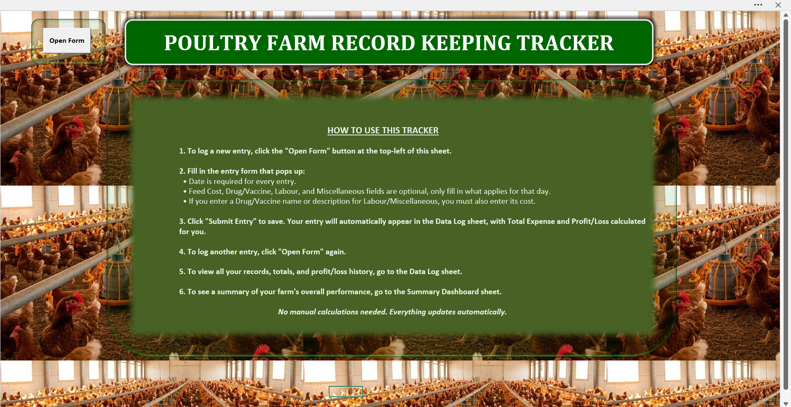
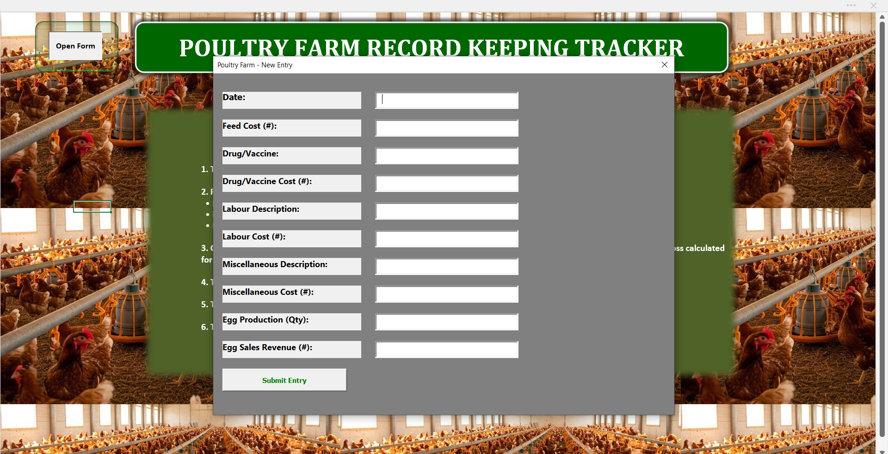
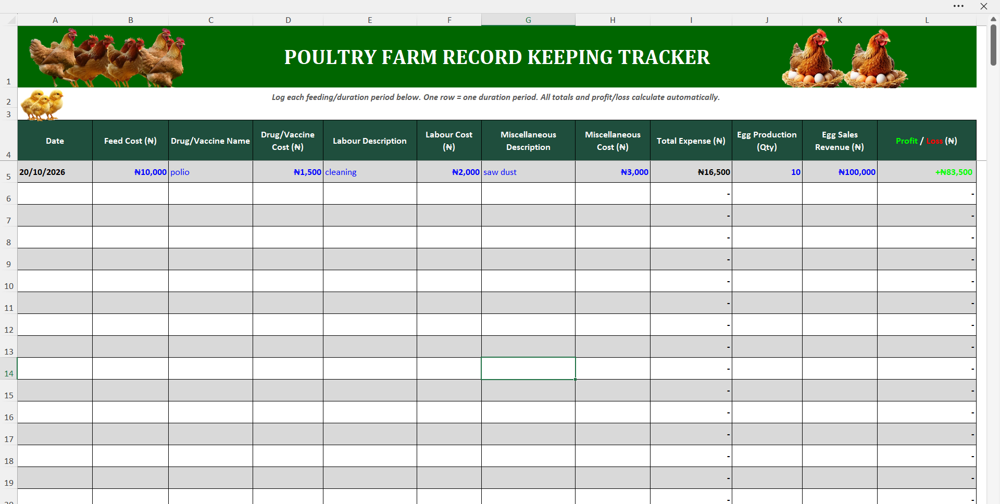
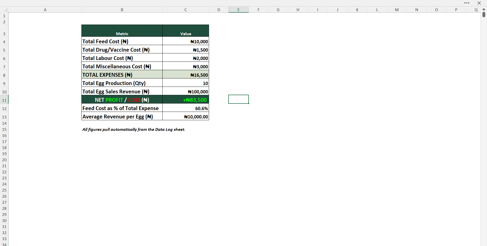

# Poultry Farm Record Keeping Tracker (Excel + VBA)

A record-keeping and automation system built for a poultry farm client, designed to answer one question instantly: **is the farm making profit or running at a loss?**

> Note: This repository contains screenshots and selected code snippets only. The full workbook is a paid deliverable and is not distributed here. For inquiries about a custom version for your business, see [Contact](obiekweemmanuel08@gmail.com)

---

## The Problem

Most small poultry farmers track feed, drug, and labour costs on paper or in scattered notes, with no reliable way to see whether the business is actually profitable at any given point. This project was built to solve that for a real client.

## The Solution

A three-sheet Excel workbook powered by VBA, combining a validated data entry form, an automated data log, and a live summary dashboard, so the farm owner never has to calculate anything by hand.

---

## How It Works

### 1. Entry Form Sheet
The landing page of the workbook. Branded, with built-in usage instructions and a button that launches a VBA UserForm for logging a new entry.



**Form Rules (enforced via VBA validation):**
- Date is required for every entry.
- Feed Cost, Drug/Vaccine, Labour, and Miscellaneous fields are optional, only what applies for that day needs to be filled in.
- Paired-field validation: if a Drug/Vaccine name or a Labour/Miscellaneous description is entered, its corresponding cost becomes required. Prevents incomplete records from ever reaching the log.



### 2. Data Log Sheet
Every submitted entry is written here automatically, one row per entry. Total Expense and Profit/Loss are calculated live via formulas injected by the VBA code at submission time, and colour-coded (green for profit, red for loss).



**A key technical detail:** the Total Expense and Profit/Loss columns are locked to prevent accidental manual edits. Standard Excel sheet protection would normally block the VBA code itself from writing to those cells, so protection is instead applied through `UserInterfaceOnly:=True`, which blocks manual editing while leaving the macro free to write formulas on every submission.

```vba
ThisWorkbook.Sheets("Data Log").Protect Password:="********", UserInterFaceOnly:=True
```

### 3. Summary Dashboard
A live rollup of the farm's overall performance, pulling directly from the Data Log:

- Total Feed Cost
- Total Drug/Vaccine Cost
- Total Labour Cost
- Total Miscellaneous Cost
- Total Expenses
- Total Egg Production (Qty)
- Total Egg Sales Revenue
- Net Profit / Loss
- Feed Cost as % of Total Expense
- Average Revenue per Egg



---

## Technical Highlights

- **VBA UserForm** with field-level validation (date format checks, numeric checks, paired-field enforcement)
- **Dynamic formula injection**: rather than relying on static formulas, the code writes the Total Expense and Profit/Loss formulas into each new row at submission time
- **`UserInterfaceOnly` sheet protection**: locks formula cells from manual user edits without blocking the macro's own write access
- **Conditional number formatting** for Profit/Loss (`[Green]+#,##0;[Red]-#,##0;"-"`) for instant visual feedback
- **Custom-branded UI**: styled UserForm, background imagery, and an in-sheet instructions panel for non-technical end users

```vba
Private Sub btnSubmit_Click()
    Dim ws As Worksheet
    Dim nextRow As Long
    Set ws = ThisWorkbook.Sheets("Data Log")

    If Not IsDate(Me.txtDate.Value) Then
        MsgBox "Please enter a valid date.", vbExclamation, "Invalid Date"
        Me.txtDate.SetFocus
        Exit Sub
    End If

    If Len(Me.txtDrugName.Value) > 0 And Len(Me.txtDrugCost.Value) = 0 Then
        MsgBox "You entered a Drug/Vaccine name, please also enter its cost.", vbExclamation
        Me.txtDrugCost.SetFocus
        Exit Sub
    End If

    ' ... additional validation and row-write logic
End Sub
```

---

## Project Background

This started as a single-sheet manual tracker built for a client's poultry farm. After sharing the project on LinkedIn, a connection suggested adding a proper data entry form to reduce manual errors, which led to a full rebuild into the validated, automated system shown here.

## Tools Used

- Microsoft Excel
- VBA (Visual Basic for Applications)

## Contact

Built by **Emmanuel (Emmy Jakes)**, Data Analyst & Founder of **Jakes Tech Galaxy (JTG)**.

Interested in a custom version of this tracker for your business? Reach out via [LinkedIn] or DM "TRACKER".
